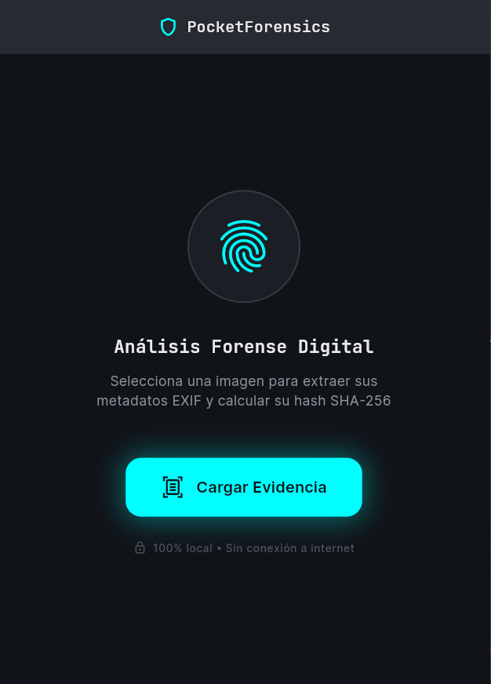
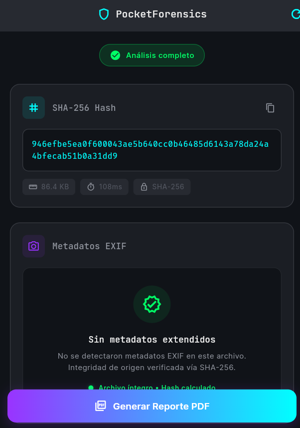

# 🕵️‍♂️ PocketForensics

Herramienta móvil de informática forense diseñada para la extracción de metadatos (EXIF) y la verificación de integridad de evidencia digital mediante hashes criptográficos (SHA-256). Procesamiento 100% local en el dispositivo (On-Device) para garantizar la privacidad y la cadena de custodia.

## ✨ Características Principales
* **Análisis de Integridad (SHA-256):** Generación de firmas digitales únicas a partir de los bytes crudos del archivo para detectar alteraciones.
* **Extracción de Metadatos EXIF:** Lectura profunda de información oculta en imágenes (Coordenadas GPS, modelo de cámara, fechas originales).
* **Procesamiento Local Seguro:** No requiere conexión a internet; los archivos nunca abandonan el dispositivo.
* **UI/UX Forense:** Interfaz moderna en Dark Mode con efectos *Glassmorphism* y animaciones fluidas para retroalimentación de estado.

## 📸 Interfaz de Usuario

  
  &nbsp;&nbsp;&nbsp;&nbsp;
  

## 🛠️ Arquitectura y Tecnologías
Este proyecto está construido con **Flutter & Dart**, aplicando principios de Clean Architecture:
* **Feature-First Structure:** Módulos altamente desacoplados (`scanner`, `report`, `history`).
* **MVVM Pattern:** Separación estricta entre la UI (Views/Animations) y la lógica de estado (ViewModels).
* **Paquetes clave:** `crypto` (cálculo de hashes), `exif` (extracción de metadatos), `image_picker` (acceso a evidencia).

## 🚀 Cómo ejecutarlo
1. Clona el repositorio.
2. Ejecuta `flutter pub get` para instalar dependencias.
3. Ejecuta `flutter run` (Soporta Android, iOS y compilación Web/Escritorio para depuración rápida).